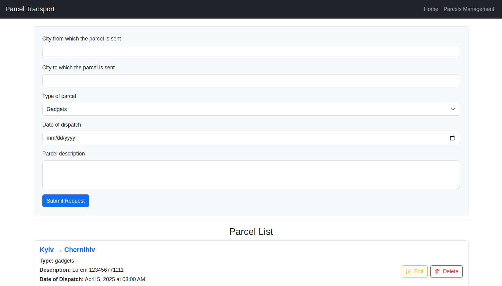

Make sure to have NodeJS version 20+ installed.

To run the server:
1. ```cd server```
2. ```npm i```
3. add .env at the root

.env should be like this
```
PORT=5000
MONGODB_URL=mongodb+srv://<user>:<password>@cluster0.rvt9mxn.mongodb.net/gotoinc-transportation?retryWrites=true&w=majority&appName=Cluster0
```

Add user and password for the Mongodb, and you should be good to go.

To run the client:
1. ```cd client```
2. ```npm i```
3. ```npm run dev```
